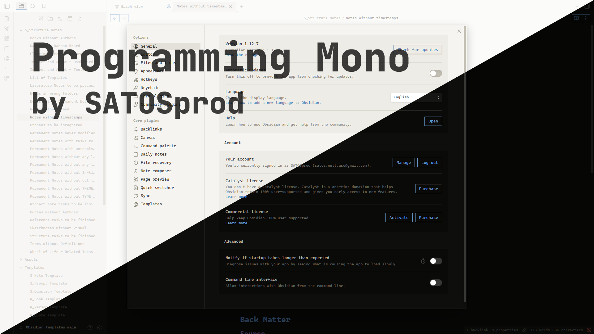
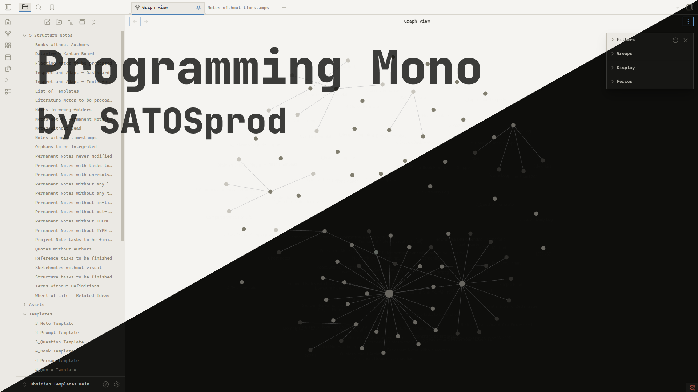
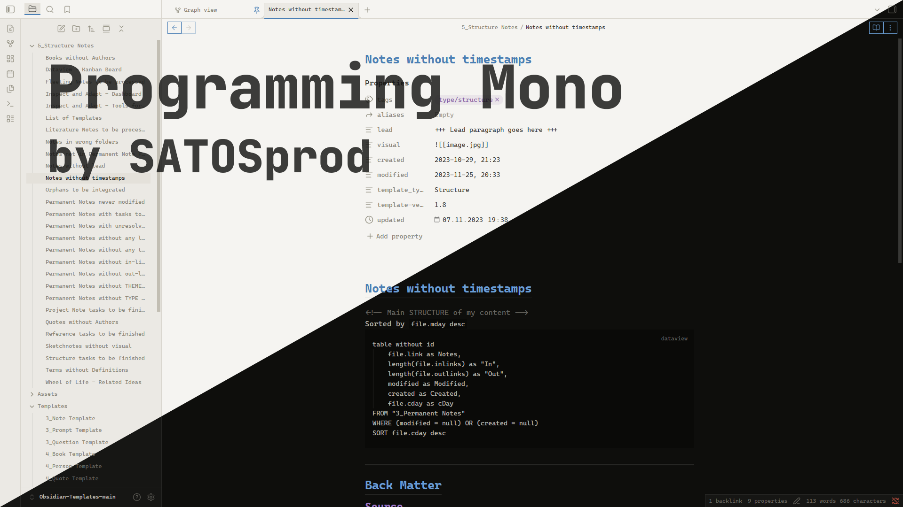

# Programming Mono

> A sharp, monospace Obsidian theme built for programmers — zero border radius, JetBrains Mono everywhere, and a restrained syntax-inspired accent palette for both dark and light mode.

**Author:** [SATOSprod](https://github.com/SATOSprod)  
**License:** Proprietary — see [LICENSE](./LICENSE)

---

## Preview



---

## Why Programming Mono?

Most Obsidian themes are built around rounded corners and a proportional UI font, which feels out of place for anyone who spends their day in a code editor. **Programming Mono** flips that: every corner is square, every font — interface, text, and code — is monospace, and the accent colors are picked to double as a readable syntax-highlighting palette. The result is a vault that looks and feels like an IDE.

---

## Features

- **Full monospace UI** — interface, editor text, and code all use `JetBrains Mono` (falls back to `Fira Code`, `Cascadia Code`, `ui-monospace`)
- **Zero border radius** — buttons, tabs, inputs, modals, panes, and scrollbars are all perfectly square
- **Dark and light variants** — both built from the same warm, low-contrast neutral palette
- **Four-color accent system** — headings H1–H4 each get a distinct accent color, reused consistently across links, tags, and code syntax
- **Syntax-highlighting-aware colors** — `--code-keyword`, `--code-string`, `--code-function`, `--code-comment`, etc. are mapped so inline code and code blocks read like a real editor
- **Flat, minimal chrome** — no shadows, no gradients, no rounded pills — just borders and flat fills
- **Custom scrollbars** — square, low-profile scrollbars matching the rest of the UI

---

## Requirements

- Obsidian **1.7.2** or later
- Works on **desktop and mobile**

---

## Installation

### From Community Themes

1. Open **Settings → Appearance → Themes**.
2. Click **Manage** next to Themes.
3. Search for `Programming Mono`.
4. Click **Install and use**.

### Manual installation

1. Download the latest release from the [Releases page](../../releases), or clone the repository:

```bash
git clone https://github.com/SATOSprod/programming-mono.git
```

2. Copy the theme folder into your vault:

```text
<your-vault>/.obsidian/themes/programming-mono/
├── theme.css
└── manifest.json
```

3. Open Obsidian → **Settings → Appearance → Themes** and select **Programming Mono**.

---

## Usage

1. Install the theme using one of the methods above.
2. Open **Settings → Appearance**.
3. Under **Base color scheme**, choose **Dark** or **Light** — Programming Mono ships full support for both.
4. Under **Themes**, select **Programming Mono**.
5. For the full intended look, pair the theme with a monospace font family such as `JetBrains Mono` installed on your system — the theme already references it by name and will fall back gracefully if it isn't installed.

---

## Color Palette

### Dark mode

| Role | Color |
|---|---|
| Background | `#0e0e0c` |
| Background alt | `#161614` |
| Code background | `#0a0a08` |
| Border | `#282826` |
| Text | `#b8b6ae` |
| Text high | `#dedad0` |
| Text low | `#686660` |

### Light mode

| Role | Color |
|---|---|
| Background | `#f5f4f1` |
| Background alt | `#ebe9e4` |
| Code background | `#eeece7` |
| Border | `#d8d5cd` |
| Text | `#3a3934` |
| Text high | `#1c1b18` |
| Text low | `#8a8778` |

### Accents (shared hues, adjusted per mode)

| Accent | Used for | Dark | Light |
|---|---|---|---|
| Accent 1 | H1, links, functions, tags | `#6a9ed4` | `#4a7fb5` |
| Accent 2 | H2, keywords | `#a07cc8` | `#8a63a8` |
| Accent 3 | H3, strings, properties | `#89c87c` | `#4f9a44` |
| Accent 4 | H4, warnings, important values | `#c06f6f` | `#b05a5a` |

---

## Configuration Notes

| Element | Behaviour |
|---|---|
| **Corners** | All corner radii (`--radius-s/m/l/xl`, buttons, tabs, inputs, checkboxes) are forced to `0px` |
| **Fonts** | `--font-text-theme`, `--font-monospace-theme`, and `--font-interface-theme` all resolve to the same monospace stack |
| **Headings** | H1–H4 use the four accent colors; H1 also gets a bottom border, H6 is uppercased and letter-spaced |
| **Code** | Inline code and code blocks use a dedicated background with a syntax-colored token set (`--code-keyword`, `--code-string`, `--code-function`, `--code-comment`, `--code-tag`, `--code-value`) |
| **Links** | Standard links use Accent 1; unresolved internal links use Accent 4 |
| **Tags** | Rendered with Accent 2, a soft tinted background, and a matching border |
| **Buttons** | Flat, bordered, transparent background; fill with the accent color on hover |
| **Scrollbars** | Square, theme-matched thumb and track colors for both modes |

---

## File Structure

```text
programming-mono/
├── theme.css
├── manifest.json
├── assets/
│   ├── 1.png
│   └── 2.png
├── cover.png
├── LICENSE
└── README.md
```

---

## How It Works

1. The theme defines a small set of raw palette variables (`--bg`, `--bg-alt`, `--bg-code`, `--border`, `--text`, `--accent-1..4`) separately for `.theme-dark` and `.theme-light`.
2. Every Obsidian CSS variable (`--background-primary`, `--text-normal`, `--interactive-accent`, `--code-*`, `--h1-color` … `--h6-color`, etc.) is mapped from that small palette, so the whole theme can be re-tuned by editing a handful of values.
3. A second block of rules forces `border-radius: 0` across buttons, tabs, inputs, modals, and panes to enforce the theme's square-corner identity regardless of Obsidian's own defaults.
4. Syntax-relevant variables (`--code-keyword`, `--code-string`, `--code-function`, `--code-comment`, `--code-tag`, `--code-value`, `--code-property`) reuse the same four accents so inline code, code blocks, and headings feel visually consistent.
5. All rules are scoped under `.theme-dark` and `.theme-light`, so switching Obsidian's base color scheme swaps the full palette instantly with no extra configuration.

---

## Screenshots





---

## License

This project is released under a **proprietary license**.  
Copying source code into other projects is **not permitted**.  
See [LICENSE](./LICENSE) for full terms.

© 2026 SATOSprod